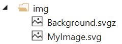

# SVG Viewer

Download the extension from the [Visual Studio Marketplace](https://marketplace.visualstudio.com/items?itemName=MadsKristensen.SvgViewer) or get the latest [CI build](http://vsixgallery.com/extension/SvgViewer.7a08d0d4-985c-4415-93d5-ddd9135d8f4f/)

--------------------------------------

## Preview image
Renders a preview of the SVG file being edited in the bottom right corner of the editor.

The rendered image is updated live while typing to provide instant feedback on changes made to the document.

## IntelliSense
Some SVG files will see much improved IntelliSense as well.

This works by forcing SVG files to open in the HTML editor which has schema information specifically for SVG files.

## File icon
Solution Explorer is also updated to show an image icon for the following file extensoins:

* .svg
* .svgz

## License
[Apache 2.0](LICENSE)