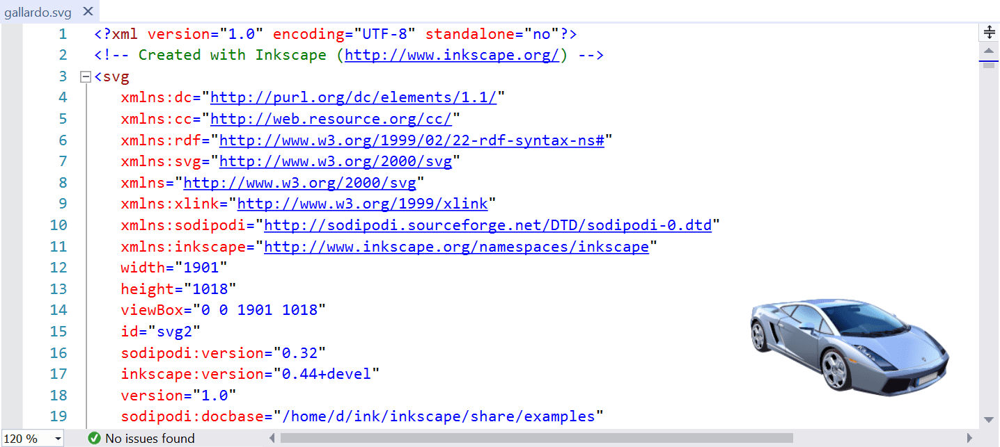
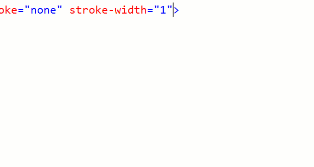
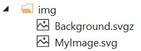

# SVG Viewer

Download the extension from the [Visual Studio Marketplace](https://marketplace.visualstudio.com/items?itemName=MadsKristensen.SvgViewer) or get the latest [CI build](http://vsixgallery.com/extension/SvgViewer.7a08d0d4-985c-4415-93d5-ddd9135d8f4f/)

---

A Visual Studio extension that makes working with SVG files easier by providing a live preview, IntelliSense, and custom file icons.

## Features

### Live Preview

Renders a live preview of the SVG file being edited, positioned in a corner of the editor window.

The preview updates automatically as you type, providing instant visual feedback on your changes.

**Interactive features:**

- 🖱️ **Click to copy** – Click on the preview to copy the rendered image to your clipboard
- 🔍 **Scroll to zoom** – Use the mouse wheel over the preview to zoom in/out (50% to 400%)
- 📍 **Hover for info** – Tooltip shows SVG dimensions, zoom level, and usage hints

### Configurable Options

Customize the preview behavior via **Tools → Options → SVG Viewer → General**:

| Option | Description | Default |
|--------|-------------|---------|
| **Preview Size** | Maximum width/height of the preview (50-1000px) | 250px |
| **Preview Position** | Corner placement (Top Left, Top Right, Bottom Left, Bottom Right) | Bottom Right |
| **Preview Margin** | Distance from the editor edge (0-100px) | 20px |
| **Show Error Indicator** | Display an error icon when SVG parsing fails | Enabled |
| **Show Loading Indicator** | Show visual feedback while rendering | Enabled |
| **Debounce Delay** | Delay before re-rendering after typing (100-2000ms) | 500ms |

### Error Visualization

When your SVG contains syntax errors, the preview shows a clear error indicator with details in the tooltip:

- Red error icon appears in place of the preview
- Tooltip displays the specific XML/SVG parsing error
- Line numbers included for XML errors to help locate issues

### IntelliSense

Enhanced IntelliSense support for SVG files with schema-based completions.

This works by opening SVG files in the HTML editor, which has built-in schema information for SVG elements and attributes.

### File Icons

Solution Explorer displays custom icons for SVG files:

- `.svg`
- `.svgz`

## Performance

The extension is designed to be lightweight and responsive:

- **Debounced rendering** – Prevents excessive re-renders while typing
- **Content caching** – Skips re-rendering when content hasn't changed
- **Memory efficient** – Reuses buffers to minimize allocations
- **Async rendering** – SVG parsing and rendering happen off the UI thread

## License

[Apache 2.0](LICENSE)
