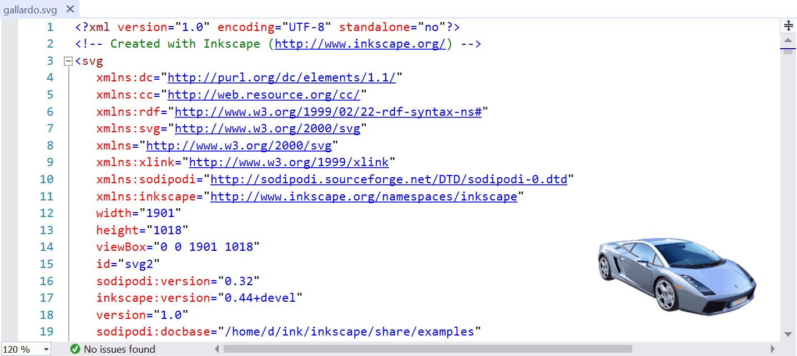

# SVG Viewer

Download the extension from the [Visual Studio Marketplace](https://marketplace.visualstudio.com/items?itemName=MadsKristensen.VsctIntellisense) or get the latest [CI build](http://vsixgallery.com/extension/SvgViewer.7a08d0d4-985c-4415-93d5-ddd9135d8f4f/)

--------------------------------------

Renders a preview of the SVG file being edited in the bottom right corner of the editor.

The rendered image is updated every time the .svg document is being saved to disk.

## License
[Apache 2.0](LICENSE)